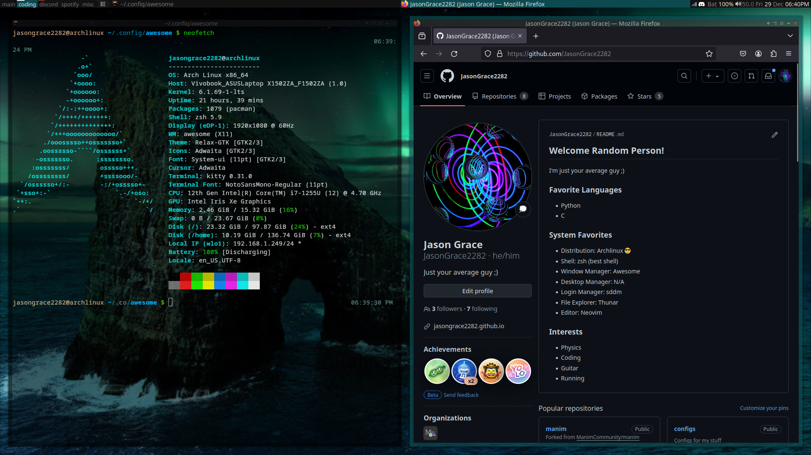

My Awsome WM Config
===================

Check out my config for Awesome WM! Initial config from Awesome WM Copycats, but I changed some stuff ;)

.. image:: awesome-wm.png
   :alt: A Screenshot of my config

If you're one of those people who (like me originally!)
is too scared to get into tiling, don't worry about it!
Tiling is great!

